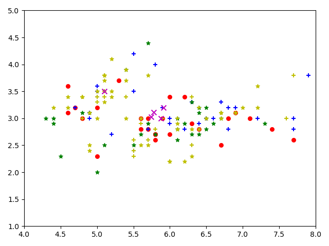

<script type="text/javascript" src="http://cdn.mathjax.org/mathjax/latest/MathJax.js?config=TeX-AMS-MML_HTMLorMML"></script>
<script type="text/x-mathjax-config">
    MathJax.Hub.Config({ tex2jax: {inlineMath: [['$', '$']]}, messageStyle: "none" });
</script>

<style>
.center 
{
  width: auto;
  display: table;
  margin-left: auto;
  margin-right: auto;
}
</style>

Granular Computing for Economy Enterprise

*粒计算企业评估*

# **A. 应用文档**

项目中包含三个文件两个模块
+ main.py
+ Data_preprocessing.py
+ GrC.py

其中GrC.py中 GranularComputing 类为粒计算 Granular Computing 中 FCM 算法的实现。

Data_perprocessing.py 中作为接受数据并进行处理的模块

main.py 调用两个模块进行应用

> *主要参数* \
>  *data_file_path*  # *数据列表，通常为csv结构*，type: str \
>  *feature_fetch_id* # *Attention机制下重点关注的数据标签id列表*，type: str \
>  *cluster* # *聚类族簇数目，默认为选取聚类单元（企业）的根号数量 $\sqrt{num(enterprise)}$， type: int

# **B. Data Input**

我们希望接受一种结构化的数据输入，如下表1所示：

<div class="center">

| Annual Tax |  Annual Assets | Worker Num | Research Investment  | Enterprise Name |
| :----: | :----: | :----: | :----: | :----: |
|5.1|3.5|1.4|0.2| enterprise_1 |
|4.9|3.0|1.4|0.2| enterprise_2 |
|4.7|3.2|1.3|0.2| enterprise_3 |
|4.6|3.1|1.5|0.2| enterprise_4 |
|5.4|3.9|1.7|0.4| enterprise_5 |
| ... | ... | ... | ... | ... |
|4.9|3.1|1.5|0.1| enterprise_m |
|5.4|3.7|1.5|0.2| enterprise_n |
|4.8|3.4|1.6|0.2| enterprise_k |
|4.8|3.0|1.4|0.1| enterprise_p |

</div>

<center>表1</center>

整个表格T包含 $(n+1) \times m$ 组数据, 其中$n$为被分析的企业数目, $m$为对应数据标签的数量
首行为$m$个数据label，之后$n \times m$个数据单元，数据之间由","分隔，如下所示。$T_{ij}$表示第$(i-1)$个企业第$j$个标签对应的值。

```
Annual Tax,Annual Assets,Worker Num,Research Investment,Enterprise Name,
5.1,3.5,1.4,0.2,enterprise_1,
4.9,3.0,1.4,0.2,enterprise_2,
4.7,3.2,1.3,0.2,enterprise_3,
4.6,3.1,1.5,0.2,enterprise_4,
5.4,3.9,1.7,0.4,enterprise_5,
...,...,...,...,...,
4.9,3.1,1.5,0.1,enterprise_m,
5.4,3.7,1.5,0.2,enterprise_n,
4.8,3.4,1.6,0.2,enterprise_k,
4.8,3.0,1.4,0.1,enterprise_p,
```

在main.py中构建类对象
```
from Data_preprocessing import *

data_file_path = "Iris.csv"
origin_data = Data(path=data_file_path)
```

# **C. Data PreProcessing**

### **数据预处理**

## **C 1.1**

在接受原始数据origin data后，以及由文字构成的label标签中，我们需要将文字信息转化为数学中的值的概念。以下表2为例：

<div class="center">

| id | 企业涉及（所属）行业 |
| :----: | :----: |
| 1 | 交通运输业 |
| 2 | 农业种植业 |
| 3 | 能源煤炭业 |
| 4 | 交通运输业 |
|... | ... |
| 100 | 新兴信息产业 |

</div>

<center>表2</center>

调用接口 ***data.text_transfer_label(id)*** 后并将生成的结果存入对应新路径  ***path_new*** 中，对应的处理效果如下表3所示：


<div class="center">

| id | 企业涉及（所属）行业 | 企业涉及（所属）行业_id |
| :----: | :----: | :----: |
| 1 | 交通运输业 | 0 |
| 2 | 农业种植业 | 1 |
| 3 | 能源煤炭业 | 2 |
| 4 | 交通运输业 | 0 |
|... | ... | ... |
| 100 | 新兴信息产业 | 8 |

</div>

<center>表3</center>

### ***<font color=red> 注：在数据清洗预处理之后，调用类接口会使新生成的整个数据表的数量结构会发生变化！例如在将文本转化为对应标签后，label的数量会随之增加</font>***

## **C 1.2**

补充缺失数据 

***missing_complement_num(id, value)*** 将id列缺失属性补充为对应value 


<div class="center">

| id | 科研经费（万元） | 
| :----: | :----: |
| 1 | 5 |
| 2 |  | 
| 3 | 3 | 
| 4 | 2 | 
|... | ... | 
| 100 |  | 

</div>

<center>表4</center>

Transfer to

<div class="center">

| id | 科研经费（万元） | 
| :----: | :----: |
| 1 | 5 |
| 2 | 0 | 
| 3 | 3 | 
| 4 | 2 | 
|... | ... | 
| 100 | 0 | 

</div>

<center>表5</center>

以及 ***missing_complement_text(id)*** 将id列所有缺失属性变为同一个value

<div class="center">


| id | 所属区域 | 
| :----: | :----: |
| 1 | 西山区 |
| 2 | 首钢经济区 | 
| 3 |  | 
| 4 |  | 
|... | ... | 
| 100 |  | 

</div>

<center>表6</center>

Transfer to

<div class="center">

| id | 所属区域_西山区 | 所属区域_首钢经济区 | 所属区域_NaN |
| :----: | :----: | :----: | :----: |
| 1 | 1 | 0 | 0 |
| 2 | 0 | 1 | 0 |
| 3 | 0 | 0 | 1 |
| 4 | 0 | 0 | 1 |
|... | ... | 0 | 1 |
| 100 | 0 | 0 | 1 |

</div>

<center>表7</center>

## Data类中不同的接口方法对应不同种类的问题进行预处理清洗，选择不同的接口或在Data类中自制更多的接口针对特定的数据标签和不同的数据清洗问题，上文提供两个示例接口 

```
origin_data.text_transfer_label(4)
origin_data.missing_complement_num(6, 0)
origin_data.missing_complement_text(7)
```

## C2.

其次，对于一些我们重点关注的label，我们增加Attention的机制, 获取我们需要的数据列以及数值化/标准化后的数据列，例如表3的数据化后的列， 我们将选取生成后的列(id=2)而不是列(id=1)，参数***feature_fetch_id*** 代表最终选择的列，其中id映射数据清洗预处理之后的列id

```
# 提取需要聚类的数据 去掉特定的列数id
# features = columns[0:len(columns) - 1]
feature_fetch_id = [0, 1, 2, 3]
```

***有一些数据标签对应的文本较为复杂不能简单的划分和归一化，需要专门应对特定的数据进行特定的处理，原则上最终的目标是将数据处理为一个结构化的structure-data***


## **D. Granular Computing**

main.py 主程序声明对象并调用

```
fcm = GranularComputing(data=data, max_iterion=100, labels=column_name)
results, matrix_center, matrix = fcm(cluster)
```

其中data 和labels是经过上一步数据预处理模块最终选择的数据列的信息，cluster表示对于分类的族簇数，默认为\sqrt{n},如果有特定任务可制定，例如

+ 我想将企业按照税收情况（与税收相关的若干数据维度方向）将企业划分为潜力极大、潜力大、潜力中等、潜力较差、潜力低 五等。
> results, matrix_center, matrix = fcm(5)
+ 我想将企业按照资产所有情况（选择与固定资产相关的对应数据维度）将企业划分为抗风险能力强、抗风险能力中等、抗风险能力差 三等。
> results, matrix_center, matrix = fcm(3)

项目基于paper < Fuzzy c-Means Algorithms for Very Large Data >,

```
@article{2012Fuzzy,
  title={Fuzzy c-Means Algorithms for Very Large Data},
  author={ Havens, T. C.  and  Bezdek, J. C.  and  Leckie, C.  and  Hall, L. O.  and  Palaniswami, M. },
  journal={IEEE Transactions on Fuzzy Systems},
  volume={20},
  number={6},
  pages={1130-1146},
  year={2012},
}
```

整个算法逻辑大致如下所示：

```   
# 初始化模糊矩阵 U
initial_matrix = self.initialize_matrix(cluster=cluster)
# 迭代
matrix_center, matrix = self.iteration(matrix=initial_matrix, cluster=cluster)
> # 计算聚类中心矩阵 matrix_center
> matrix_center = self.CalculateCenter(matrix=matrix, cluster=cluster)
> # 更新模糊矩阵 matrix_new
> matrix = self.matrix_update(init_matrix=matrix, matrix_center=matrix_center, cluster=cluster)
> # 得到更新后的中心矩阵
> matrix_center_new = self.CalculateCenter(matrix=matrix, cluster=cluster)
> # 如果matrix_center_new和matrix_center的距离小于阈值，迭代停止
> distance = 0
> for i in range(cluster):
    for j in range(len(self.labels)):
        distance = (matrix_center_new[i][j] - matrix_center[i][j]) ** 2 + distance
> if sqrt(distance) < self.Epsilon:
    break
# 获得聚类结果
results = self.get_cluster_id(matrix=matrix)
```

输出结果以 fcm(5) 为例
```
> [4, 2, 2, 4, 0, 0, 2, 2, 4, 2, 0, 1, 1, 4, 3, 4, 2, 2, 1, 0, 3, 0, 4, 0, 2, 0, 3, 1, 4, 1, 0, 3, 1, 0, 1, 1, 0, 3, 1, 2, 3, 0, 0, 0, 2, 0, 4, 1, 3, 1, 1, 3, 4, 0, 2, 1, 3, 1, 1, 2, 3, 1, 4, 1, 4, 0, 4, 1, 0, 1, 4, 3, 3, 1, 0, 2, 1, 1, 0, 2, 4, 1, 2, 3, 2, 4, 4, 0, 1, 0, 1, 4, 4, 4, 1, 1, 3, 1, 3, 1, 4, 1, 1, 2, 0, 1, 4, 1, 3, 1, 2, 4, 4, 2, 3, 1, 4, 3, 3, 4, 2, 2, 3, 2, 4, 1, 0, 4, 4, 0, 3, 3, 3, 3, 1, 1, 1, 1, 2, 2, 3, 0, 1, 3, 3, 4, 2, 0, 2, 0]
> 用时：2.193113088607788 s
```

对应将150个实体以选取的[0,1,3]三列数据维度为依据划分为5类的结果，结果list中对应的数字是该实体对应所在类簇

整个demo基于FCM算法，其扩展算法仍有较大提升空间，包括spFCM、oFCM、kFCM、reskFCM、spkFCM、okFCM等

## **E.结果可视化**

调用***GranularComputing*** 类中***result_plt_show*** 接口方法

以项目代码为例

<font color=red>（如果使用plot3D可以选择3个维度可视化，2D则使用两个维度可视化）</font>

样本点中 plt.scatter  其中nonzero(results==0)为取出0这一类的下标，marker对应的标记，color对应颜色
```
# matplotlib需要array类型的数据,需要将数据np.array处理
data_array = np.array(self.data)
center = np.array(center)
results = np.array(results)
# example
# 将DATA的第一列和第二列作为x、y轴绘图
plt.xlim(4, 8)
plt.ylim(1, 5)
# 创建一个绘图窗口
plt.figure(1)
# 画散点图

plt.scatter(data_array[nonzero(results == 0), 0], data_array[nonzero(results == 0), 1], marker='o', color='r', label='0', s=30)
plt.scatter(data_array[nonzero(results == 1), 0], data_array[nonzero(results == 1), 1], marker='+', color='b', label='1', s=30)
plt.scatter(data_array[nonzero(results == 2), 0], data_array[nonzero(results == 2), 1], marker='*', color='g', label='2', s=30)
plt.scatter(data_array[nonzero(results == 3), 0], data_array[nonzero(results == 3), 1], marker='*', color='y', label='3', s=30)
plt.scatter(data_array[nonzero(results == 4), 0], data_array[nonzero(results == 4), 1], marker='+', color='y', label='3', s=30)
# 中心点
plt.scatter(center[:, 0], center[:, 1], marker='x', color='m', s=50)
plt.show()
```

可以针对想表达的数据维度选择对应的可视化角度并将对应的实体标注，最终展示出对应的粒计算聚类效果。如下图1所示：

<div align=center></div>

<center>图1 demo效果演示</center>
